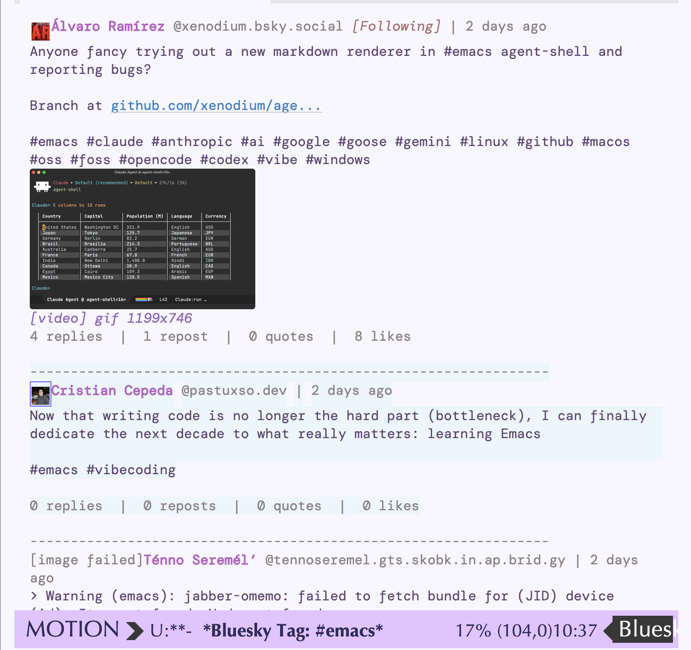

# A Bluesky client for Emacs

This is a Bluesky client for Emacs, capable of reading feeds, responding, posting, and most other functionality that is needed to have a complete Bluesky experience.

* Installation

=bluesky= is available from MELPA, so you can add MELPA to your package archives and use =use-package= to install:

#+begin_src emacs-lisp
(use-package bluesky)
#+end_src

With Emacs 30 or newer, install directly from this repository using
=use-package= and =:vc=:

#+begin_src emacs-lisp
(use-package bluesky
  :vc (:url "https://github.com/ahyatt/emacs-bluesky.git"))
#+end_src

If you are working from a local checkout instead, add the checkout directory to
=load-path=:

#+begin_src emacs-lisp
(add-to-list 'load-path "/path/to/emacs-bluesky")
(require 'bluesky)
#+end_src

* Credentials

=M-x bluesky= looks up credentials with =auth-source= for the host in
=bluesky-default-host=, which defaults to =bsky.social=.  Store your handle as
the user and a Bluesky app password as the secret.

For example, an =authinfo= entry can look like this:

#+begin_example
machine bsky.social login your-handle.bsky.social password your-app-password
#+end_example

You can also call =M-x bluesky= and enter the username or password when
prompted.

* Usage

Run:

#+begin_example
M-x bluesky
#+end_example

This opens the timeline buffer.  In =bluesky-mode=:

- =g= refreshes the timeline.
- =l= loads more posts.
- =j= and =k= move between posts.
- =RET= opens the selected post's thread.
- =o= opens links or media from the selected post.
- =n= opens a new post composer.
- =r= opens a reply composer.
- =L= toggles like.
- =R= toggles repost.
- =b= toggles bookmark.

Timeline replies are controlled by =bluesky-timeline-reply-display=.  The default
value, =context=, shows available root and parent posts above a followed reply.
Set it to =hide= to omit replies from the home timeline, or =standalone= to show
replies without context.

Other feed-like views:

- =M-x bluesky-author= opens an author's posts.  From a Bluesky buffer it
  defaults to the selected post's author and completes authors seen in loaded
  timelines, threads, searches, custom feeds, and notifications.
- =M-x bluesky-search= opens a post search timeline.
- =M-x bluesky-tag= opens a hashtag search timeline.
- =M-x bluesky-feed= opens custom feed generators.  An =at://= URI opens that
  feed directly, a search string discovers matching custom feeds, an =@handle=
  discovers custom feeds created by that actor, and an empty input discovers
  popular custom feeds.  Use =M-x bluesky-author= for a user's posts.
- =M-x bluesky-notifications= opens account notifications.
- =M-x bluesky-likes= opens like notifications.
- =M-x bluesky-replies= opens reply notifications.

Compose buffers use =bluesky-post-mode=:

- =C-c C-c= submits the post or reply.
- =C-c C-k= cancels the compose buffer.
- =C-c C-a= attaches an image or MP4 video.
- =C-c C-d= clears attached media.

* Programmatic posting

Elisp can post without opening a compose buffer by calling =bluesky-post=.  It
uses the same =auth-source= lookup as =M-x bluesky=, so this works from an Emacs
session that hasn't yet authed, when credentials are available:

#+begin_src emacs-lisp
(let ((created (bluesky-post "Hello from Emacs")))
  (message "Posted %s" (plist-get created :uri)))
#+end_src

Pass =:username=, =:password=, or =:host= to override credential lookup, and
=:source-format= with =plain=, =markdown=, or =org= to reuse the compose
buffer's rich-text conversion.  Markdown and Org links are converted into
Bluesky link facets, and bare URLs and hashtags are faceted automatically.
Bluesky rich text does not currently support bold, italics, underline,
strike-through, or code styling facets, so those source markers are posted as
literal text.  Use =bluesky-post-async= instead when you want the
future-returning nonblocking form:

#+begin_src emacs-lisp
(bluesky-post-async
 "Hello from Emacs"
 :callback (lambda (created)
             (message "Posted %s" (plist-get created :uri))))
#+end_src

When text exceeds Bluesky's limits, posting signals
=bluesky-post-text-too-long=.  Clients should handle this condition when
accepting user-provided text.  The signal data includes the message followed by
=:characters=, =:character-limit=, =:bytes=, and =:byte-limit=:

#+begin_src emacs-lisp
(condition-case err
    (bluesky-post text)
  (bluesky-post-text-too-long
   (let ((data (cdr err)))
     (message "Too long: %s chars, %s bytes"
              (plist-get (cdr data) :characters)
              (plist-get (cdr data) :bytes)))))
#+end_src

* Programmatic reading

The lower-level API helpers in =bluesky-conn.el= return =futur= objects that
resolve to Bluesky app-view JSON decoded as Emacs plists and vectors.  They use
the cached authenticated session created by =bluesky=, =bluesky--with-session=,
or =bluesky-conn-create-session=, and refresh expired tokens automatically.

Common read entry points are:

- =bluesky-conn-get-timeline= for the authenticated user's home timeline.
- =bluesky-conn-get-author-feed= for posts by a handle or DID.
- =bluesky-conn-get-feed= for a custom feed generator =at://= URI.
- =bluesky-conn-search-posts= for post search.
- =bluesky-conn-get-post-thread= for a post and its thread, given the post's AT URI.
- =bluesky-conn-get-actor-feeds= and
  =bluesky-conn-get-popular-feed-generators= for discovering custom feeds.
- =bluesky-conn-list-notifications= for account notifications.

Feed-like responses contain a =:feed= vector.  Each entry usually contains a
=:post= app-view object, and each post includes its author app-view object under
=:author=.  The post text is in the repo record at =(:record :text)=, while
stable identifiers are available as =:uri= and =:cid=.

#+begin_src emacs-lisp
(bluesky--with-session
 (lambda (host session)
   (let ((handle (plist-get session :handle)))
     (futur-bind
      (bluesky-conn-get-author-feed host handle "bsky.app" nil 25)
      (lambda (response)
        (dolist (entry (append (plist-get response :feed) nil))
          (let* ((post (plist-get entry :post))
                 (record (plist-get post :record))
                 (author (plist-get post :author)))
            (message "%s: %s"
                     (plist-get author :handle)
                     (plist-get record :text)))))))))
#+end_src

The timeline endpoint has the same basic shape, but home timeline entries can
also include reply context.  Use =bluesky--timeline-response-posts= if you want
the same reply-context behavior used by the interactive timeline, or
=bluesky--feed-response-posts= if you only want the direct =:post= objects from
a feed response.

#+begin_src emacs-lisp
(bluesky--with-session
 (lambda (host session)
   (let ((handle (plist-get session :handle)))
     (futur-bind
      (bluesky-conn-get-timeline host handle nil 50)
      (lambda (response)
        (mapcar (lambda (post)
                  (list :uri (plist-get post :uri)
                        :text (plist-get (plist-get post :record) :text)
                        :author (plist-get
                                 (plist-get post :author)
                                 :handle)))
                (bluesky--timeline-response-posts response)))))))
#+end_src

To inspect one post in thread context, pass the post's AT URI to
=bluesky-conn-get-post-thread=.  The response contains a =:thread= tree of
=app.bsky.feed.defs#threadViewPost= objects rather than a flat =:feed= vector.

#+begin_src emacs-lisp
(bluesky--with-session
 (lambda (host session)
   (futur-bind
    (bluesky-conn-get-post-thread
     host
     (plist-get session :handle)
     "at://did:plc:example/app.bsky.feed.post/example"
     6
     80)
    (lambda (response)
      (let* ((thread (plist-get response :thread))
             (post (plist-get thread :post)))
        (message "Thread root: %s" (plist-get post :uri)))))))
#+end_src

There is currently no dedicated wrapper for standalone profile lookup.  If you
need that, call the generic XRPC helper directly or add a small wrapper around
=app.bsky.actor.getProfile=.
